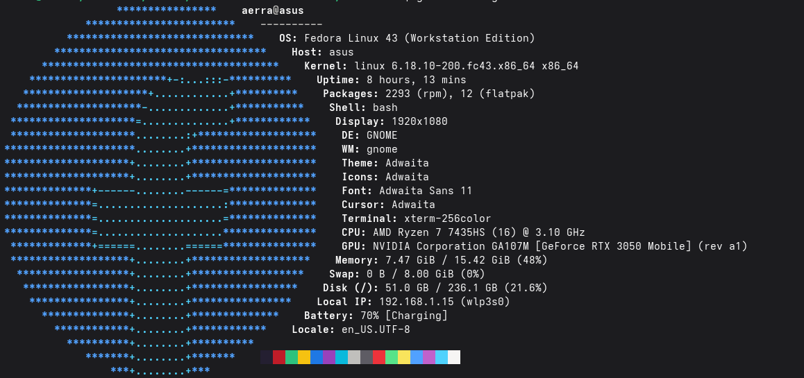

## Instalasi Cepat

Gak pake lama, langsung kopas ini di terminal:

```bash
curl -sSL https://raw.githubusercontent.com/broman0x/malasfetch/main/install.sh | bash
```

---

## Instalasi Manual

Kalau kamu tipe yang lebih suka ngerakit sendiri:

```bash
git clone https://github.com/broman0x/malasfetch.git
cd malasfetch
chmod +x install.sh
./install.sh
```

---

## Uninstall

```bash
sudo malasfetch uninstall
```

---


## Penggunaan

Cukup panggil:
```bash
malasfetch
```

### Opsi Tambahan
| Flag | Fungsi |
| :--- | :--- |
| --json | Output mentah format JSON |
| --tanpa-warna | Tampil polos tanpa ANSI color |
| --versi | Cek versi aplikasi |

---

## Tampilan



Dapatkan binary terbaru di [Halaman Release](https://github.com/broman0x/malasfetch/releases).

---

## Lisensi
Proyek ini di bawah lisensi **MIT**. Bebas dipake, asal jangan buat yang aneh-aneh!
